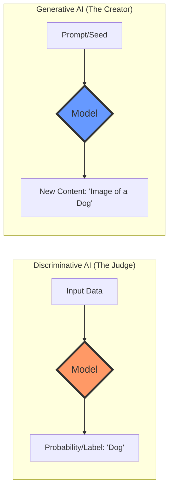
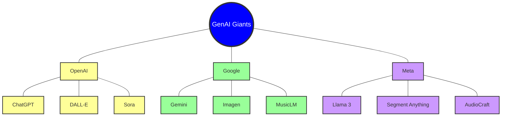
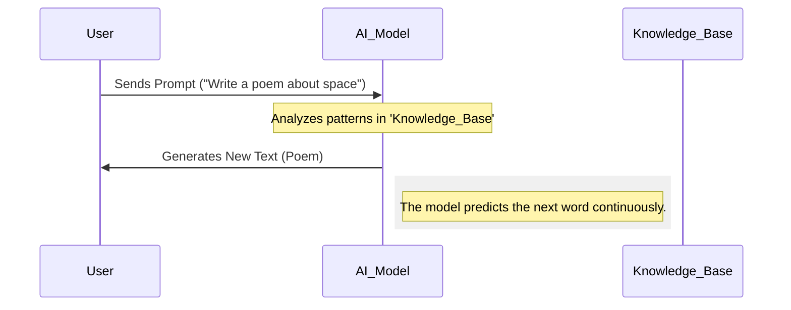
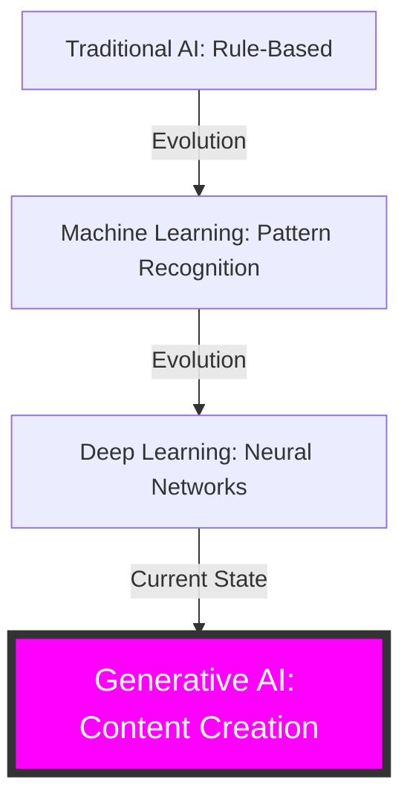

# Day 1: Introduction to Generative AI

## 1. Definitions

*   **Generative AI (GenAI)**: A branch of Artificial Intelligence focused on creating new, original content (text, images, audio, video, etc.) from existing data patterns, rather than just analyzing or classifying it.
*   **Discriminative Models**: AI models designed to classify data or predict labels (e.g., "Is this a picture of a cat or a dog?"). They learn the boundary between classes.
*   **Generative Models**: AI models designed to understand the underlying structure of data to generate new examples (e.g., "Draw me a completely new picture of a cat.").
*   **Key Players**:
    *   **OpenAI**: Creator of ChatGPT and DALL-E.
    *   **Google (DeepMind)**: Creator of Gemini and PaLM.
    *   **Meta (AI Research)**: Creator of the Llama family of open-source models.

## 2. Layman's Analogy

Imagine a high-end **Restaurant**:
*   **Discriminative AI** is like a **Food Critic**. They taste a dish and tell you exactly what it is, if it's salty, or if it belongs to Italian cuisine. They are experts at *identifying* and *judging*.
*   **Generative AI** is like the **Head Chef**. They don't just judge food; they take ingredients (data) and their knowledge of recipes (patterns) to *create* a brand-new dish that has never been served before.

## 3. Beginner-Friendly Explanation

Generative AI is a shift from "AI that learns to recognize" to "AI that learns to create." 

For years, AI was mostly about **Classification**. If you showed an AI 1,000 photos of a bridge, it could eventually tell you "Yes, that's a bridge." That is Discriminative AI.

**Generative AI** takes it a step further. After seeing those 1,000 photos, it learns the "concept" of a bridge—the arches, the cables, the way it spans water. When you ask it, "Describe a bridge in a sunset over a neon city," it uses those learned patterns to paint a unique picture or write a description that didn't exist before.

The current "GenAI Boom" is powered by massive models trained on nearly all the text and images on the internet. These models (like GPT-4 or Gemini) are so powerful because they have seen almost every pattern of human language, allowing them to predict the next most likely word or pixel with incredible accuracy.

## 4. Visual Learning (Mermaid Diagrams)

### Diagram 1: The Core Difference


### Diagram 2: Key Players & Flagship Models


### Diagram 3: Simple GenAI Workflow


### Diagram 4: Evolution from Traditional to GenAI


## 5. Code Playground

### Example 1: OpenAI (The Pioneer)
```python
from openai import OpenAI

client = OpenAI(api_key="your_key")

response = client.chat.completions.create(
  model="gpt-3.5-turbo",
  messages=[{"role": "user", "content": "Define Generative AI in one sentence."}]
)
print(f"OpenAI says: {response.choices[0].message.content}")
```

### Example 2: Google Gemini (The Multi-modal Powerhouse)
```python
import google.generativeai as genai

genai.configure(api_key="your_key")
model = genai.GenerativeModel('gemini-1.5-flash')

response = model.generate_content("What is the difference between Generative and Discriminative AI?")
print(f"Gemini says: {response.text}")
```

### Example 3: Groq (The Speed King)
```python
from groq import Groq

client = Groq(api_key="your_key")

completion = client.chat.completions.create(
    model="llama3-8b-8192",
    messages=[{"role": "user", "content": "Who are the top 3 players in GenAI?"}]
)
print(f"Groq/Llama says: {completion.choices[0].message.content}")
```

### Example 4: OpenRouter (The Aggregator)
```python
import requests
import json

response = requests.post(
  url="https://openrouter.ai/api/v1/chat/completions",
  headers={"Authorization": "Bearer your_key"},
  data=json.dumps({
    "model": "mistralai/mistral-7b-instruct",
    "messages": [{"role": "user", "content": "Give me a GenAI fun fact."}]
  })
)
print(f"OpenRouter says: {response.json()['choices'][0]['message']['content']}")
```

### Example 5: Ollama (The Local Privacy King)
```python
import requests

# Ensure Ollama is running locally first!
url = "http://localhost:11434/api/generate"
data = {
    "model": "llama3",
    "prompt": "Why is Generative AI a game changer?",
    "stream": False
}

response = requests.post(url, json=data)
print(f"Local Ollama says: {response.json()['response']}")
```

## 6. Lab Exercises

1.  **The Prompt Test**: Compare the output of ChatGPT (OpenAI) and Gemini (Google) for the same prompt: "Explain a black hole to a toddler." Note the differences in tone and detail.
2.  **Creation vs Classification**: Use a tool like Google Lens (Discriminative) to identify an object in your room, then use ChatGPT (Generative) to write a short story about that object.
3.  **Local Setup**: Install **Ollama** on your machine and download the 'Llama3' model. Run your first local AI query.
4.  **Key Player Research**: Visit the websites of OpenAI, Google DeepMind, and Meta AI. Find one flagship model name from each that isn't mentioned in this guide.
5.  **Pattern Recognition**: Write a sequence of numbers (e.g., 2, 4, 6, 8) and ask a GenAI model what comes next and *why*. This demonstrates its pattern-matching ability.

## 7. POC Ideas

1.  **AI Name Generator**: A simple Python script that uses Gemini to generate creative names for a new startup based on user keywords.
2.  **The "AI Critic" Bot**: Use a Discriminative approach (sentiment analysis) to tell if a movie review is positive, then use a Generative approach to rewrite a negative review into a positive one.
3.  **Local Privacy Chat**: Build a simple local Streamlit UI that connects to Ollama, ensuring no data ever leaves your computer.
4.  **Multi-Model Comparison Dashboard**: A small app that sends one prompt to Groq, OpenAI, and Gemini simultaneously and displays their answers side-by-side for comparison.
5.  **GenAI History Timeline**: A website that uses an LLM to generate a timeline of key GenAI milestones and renders it using a JS library.

## 8. Knowledge Check

**Q1: What is the primary goal of Generative AI?**
*   A) To classify images into categories
*   B) To create new and original content
*   C) To filter spam emails
*   D) To calculate complex mathematical equations

**Q2: Which company created the Llama family of models?**
*   A) OpenAI
*   B) Google
*   C) Microsoft
*   D) Meta

**Q3: Which of these is a 'Discriminative' task?**
*   A) Writing a poem about rain
*   B) Translating English to French
*   C) Identifying if a transaction is 'Fraud' or 'Not Fraud'
*   D) Generating a digital painting of a mountain

**Q4: What does 'Tokens' refer to in GenAI?**
*   A) Digital currency used to pay for models
*   B) The individual units of text (like words or sub-words) that the model processes
*   C) The physical servers where AI is stored
*   D) The password used to access an API

**Q5: Why are 'Context Windows' important?**
*   A) They determine the physical size of the monitor
*   B) They limit how much text the model can "remember" or look at in a single conversation
*   C) They are the windows in the building where AI is developed
*   D) They help the computer run faster

---
**Answers**: Q1: B | Q2: D | Q3: C | Q4: B | Q5: B

## 9. Beginner's Summary

Generative AI is a revolutionary type of Artificial Intelligence that moves beyond simply recognizing patterns to actually creating brand-new things. Whether it's writing an essay, creating an image, or composing music, GenAI uses its vast "knowledge" of existing data to find the most likely and creative ways to build something original.

Think of it as the difference between a student who can only pass multiple-choice tests (Traditional/Discriminative AI) and a student who can write a creative essay (Generative AI). Today, we are seeing giant companies like OpenAI, Google, and Meta compete to build the smartest and most creative "students" the world has ever seen.
